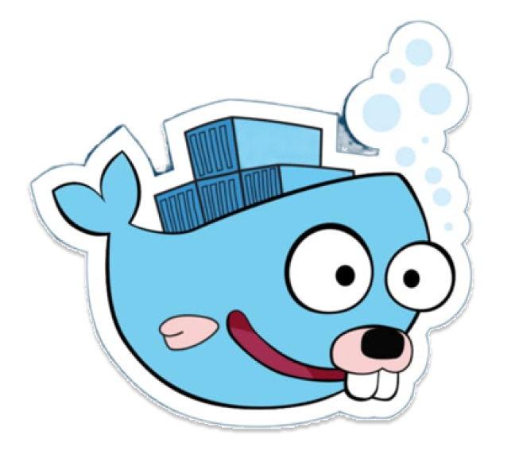

<<<<<<< HEAD
<h1 align="center">Hi 👋, I'm daizuongkk</h1>
<h3 align="center">Success doesn’t just happen, we create it.</h3>

  

  

<h3 align="left">Connect with me:</h3>

<h3 align="left">Languages and Tools:</h3>

                       

&nbsp;

=======
<!-- Title The Full Name -->

  

<!-- Social icons section -->

  
  &#8287;&#8287;&#8287;&#8287;&#8287;
  
  &#8287;&#8287;&#8287;&#8287;&#8287;
  
  &#8287;&#8287;&#8287;&#8287;&#8287;
  
  &#8287;&#8287;&#8287;&#8287;&#8287;
  
  &#8287;&#8287;&#8287;&#8287;&#8287;
  

<!-- Information myself -->
<h2>👋 Hi there, Good Day</h2>

  

  

Tôi đam mê công nghệ, đặc biệt là phát triển hệ thống phụ trợ. Tôi thích học hỏi, khám phá kiến thức mới,
và tích cực đóng góp vào các dự án mã nguồn mở cho cộng đồng. Ngoài ra mình thường xuyên chia sẻ kiến ​​thức trên kênh TikTok của mình

<picture>
  <source media="(prefers-color-scheme: dark)" srcset="https://raw.githubusercontent.com/daizuongkk/daizuongkk/output/pacman-contribution-graph-dark.svg">
  <source media="(prefers-color-scheme: light)" srcset="https://raw.githubusercontent.com/daizuongkk/daizuongkk/output/pacman-contribution-graph.svg">
  
</picture>

  

<h2>📚 Language and Tools</h2>

   
   
  
   
  
   
   
   
  
  
  
  
  
  
  
  
  
  

<!-- More Information Details Myself -->

 More about me, backend dev 🔥
  

</a>

<picture>
  <source media="(prefers-color-scheme: dark)" srcset="https://raw.githubusercontent.com/daizuongkk/daizuongkk/output/pacman-contribution-graph-dark.svg">
  <source media="(prefers-color-scheme: light)" srcset="https://raw.githubusercontent.com/daizuongkk/daizuongkk/output/pacman-contribution-graph.svg">
  
</picture>

 <h3 align="left"> 📚 Languages and Tools </h3>

  
  
  
  
  
  
  
  
  
  
  
  
	

<h3>🔥 Streak Stats</h3>

  <!-- GitHub Readme Streak Stats - https://github.com/DenverCoder1/github-readme-streak-stats -->
  

    
    
🔥 Get streak stats for your profile at <a href="daizuongkk.github.io">daizuongkk.github.io</a>

  

<h3>💻💬 GitHub Profile Stats</h3>

  

    
    
    
    
    
    
    
    
    
    
    
    
    
    
    
    
    
    
    
    
    
    
    
    

<b>Note:</b> Top languages is only a metric of the languages my public code consists of and doesn't reflect experience
or skill level.

<h3>⚡ Recent GitHub Activity</h3>

 
  

  

<a href="https://github.com/daizuongkk">

>>>>>>> 832d9c1 (daizuongkk)
